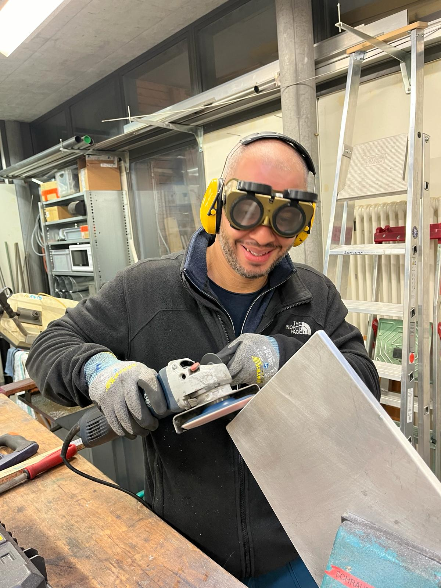

+++
title = "Die Musik des Neuanfangs "
date = "2024-06-12"
draft = false
pinned = false
image = "download.jpg"
+++
*Autor James Winfield* 

**Der neue Tag bricht an über dem Campus Muristalden. Kurz nach sechs Uhr öffnen die Haupteingänge des Schulgeländes. Um diese Zeit ist Edy, der Hauswart, der erste, welcher über das Gelände läuft und seine Aufschliessrunde macht. Im Lüftungskeller kontrolliert Edy die Zustände der Lüftungen und Heizungen. Er schaltet auch die Lichter in der ganzen Schule an, bevor der Schultag beginnt. Edy ist im Muristalden bekannt als einer der freundlichen und lustigen Hauswarte, doch vor 20 Jahren sah sein Leben anders aus.**



Edy ist am 1.Februar 1982 in Angola als Portugiese geboren und ist dort auch aufgewachsen. In 1999 ist er nach Lissabon umgezogen und hat dort als Hilfsbauarbeiter, Rezeptionist und als Techniker gearbeitet. Von 2008 bis 2010 hat er eine Jazzschule besucht und hat von 2006 bis 20011 als professioneller Musiker gearbeitet. In 2011 ist Edy dann in die Schweiz umgezogen.



**Wir drehen die Uhr zurück**

Vor ungefähr 20 Jahren befindet sich der gebührte Portugiese in einem alltäglichen Ablauf eines «Neun bis Fünf»-Jobs in einer Technikfirma in Lissabon und träumt davon ein Rockstar wie Bon Jovi zu sein. Eine Begegnung mit einem Freund öffnet ihm die Türe zur Musikszene und entfacht seine Leidenschaft, die er schon als Kind für die Musik hatte. Edy spielt neu in der Musikszene von Lissabon mit, hat viel Erfolg mit der Musik und tritt bei vielen Konzerten auf. In dieser Zeit wird Edy auch auf den Strassen erkannt als Russo, welcher sein Bühnennamen ist. Als Bassist bei «Lura», einer bekannten Fado Sängerin, geht er auch mit auf Welttourneen und spielt unter anderem im Sydney Opera House. Er weiss, dass er den richtigen Weg gefunden hat und dass er seinen Kindheitstraum erfüllt hat.

**Ferien in der Schweiz**

Auf das Thema Liebe reagiert Edys Gesicht am meisten, seine Mundecken zieht sich hoch bis zu den Ohren und mit einer überzeugten Stimme fängt Edy an zu erzählen; Im Jahr 2011 trifft er seine Liebe, Fabienne, aus der Schweiz, die Ferien in Portugal macht, leider muss sie aber wieder in die Schweiz zurück. Edy nimmt sich Ferien und begleitet sie in die Schweiz. Ihm gefällt es in der Schweiz, die Natur und die Lebensweise, auch wenn alles viel teurer ist als Lissabon. Für eine Weile reist Edy zwischen der Schweiz, dem Rest der Welt und Lissabon hin und her, doch nach einer Zeit wird für Edy klar, dass es so nicht weiter gehen kann, und er entscheidet sich dazu, einen Job in der Schweiz zu finden.

**«Einmal Musiker immer Musiker»**

 In der Schweiz findet Edy einen Job in einer Reinigungsfirma und lernt dazu auch noch Deutsch, um sich besser in der Schweiz integrieren zu können. Edy findet heraus, dass es in der Schweiz schwierig ist, mit Musik Geld zu machen, und für Edy wird es immer schwieriger mit der Musikkarriere weiterzumachen . Auch mit dem neuen Job hat er weniger Zeit für die Musik. 

*«Es war einfach nicht mehr Kompatibel»* 

Es führt dazu, dass Edy Lura anruft und ihr erzählt, dass er nicht mehr musizieren wird. Mit 30 entscheidet sich Edy dazu, eine Lehre als Sanitär zu machen. Er formt sein Leben um die Lehre, dass heisst, er handelt wie ein Sanitär und spricht auch wie einer, er denkt, dass seine Persönlichkeit so wie ein Sanitär sein muss, da er jetzt einer ist. Doch in ihm drinnen war es unwohl und er weiss nicht ganz, was er wirklich ist, Sanitär oder Musiker. Er ruft Lura an und erzählt ihr von seiner Situation und sie sagt zu ihm; " Edy, wenn du einmal Musiker warst, bist du für immer Musiker". Also kommt Edy zum Schluss, dass er doch ein Musiker ist, alles was ihm fehlt, ist Zeit.

**Mehr Zeit und neuer Job**

Er sucht sich eine neue Stelle, bei welcher er mehr Zeit für die Musik hat. Er schaut sich Inserate an und findet eines für Hauswart. Ihm gefällt das, da man für diese Stelle einen ausgebildeten Sanitär sucht und Edy genau das ist. Er bewirbt sich, hat mehrere Vorstellungsgespräche und nach einer Zeit landet er dann beim Muristalden. Ihm gefällt es dort, die Leute sind nett und lustig und die Arbeitsprozente sind zwischen 60 und 80, dies ist perfekt für Edy, so hat er einen Job, aber auch genug Zeit für die Musik.

 **Neues Leben in der Schweiz**

Edy ist nicht einfach in das neue Leben in der Schweiz gestartet, doch er war bereit diese Herausforderung anzunehmen. So lernte er Deutsch und hat auch eine Lehre mit 30 abgeschlossen. Als ich frage, ob Edy noch kontakt hat zu seinen Bandmitgliedern hat erzählt er mir mit einer warmen und fröhlichen stimme, dass er immer, wen er Ferien in Portugal macht, zuerst bei all seinen Kollegen zu Gast ist und dort in alte Zeiten abtaucht.

 *«Das Gefühl, lebendig zu sein, das mir die Musik gibt, ist unbezahlbar. Es bringt mich dazu, mich wirklich lebendig zu fühlen.»*

Auf die Frage, ob Edy seine alten Zeiten als Musiker vermisst, zögert er einen Moment. Edy ist zufrieden mit dem was er jetzt hat, er schätzt die Verantwortung und Sicherheit die er jetzt hat, aber etwas Nostalgie schwingt mit und das Musik für ihn ein ganz wichtiger Teil ist, bleibt auch in der Schweiz so.