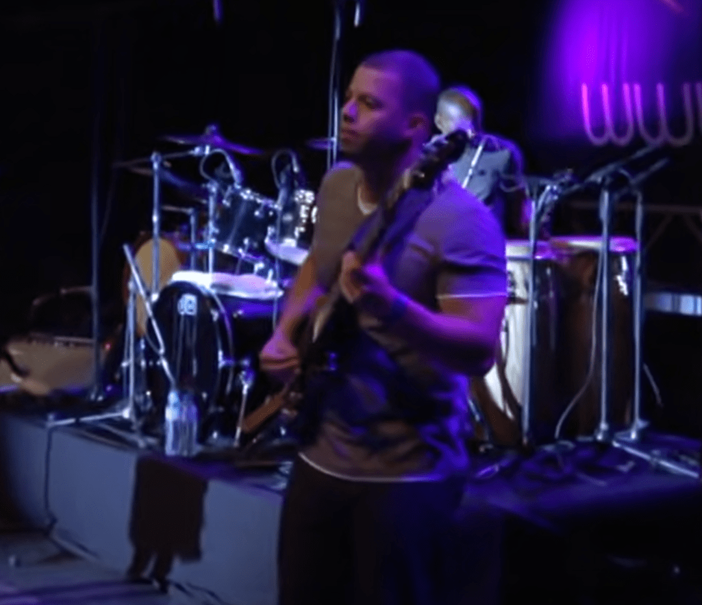
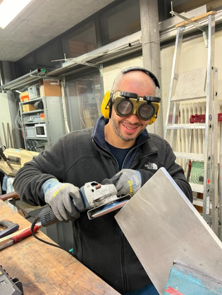

+++
title = "Vom Musiker auf Welttournee zum freundlichen Hauswart im Schulhaus"
date = "2024-04-27"
draft = false
pinned = false
+++
# **Vom Musiker auf Welttournee zum freundlichen Hauswart im Schulhaus**

**Ein Leben als Rockstar, das hat sich Edy erträumt und tourte als Musiker Rosso um die Welt. Der Liebe folgte er in die Schweiz und hat sich ein neues Leben mit neuem beruf aufgebaut. Vermisst er sein altes Leben und die Musik? Ein Leben als Rockstar, das hat sich Edy erträumt und tourte als Musiker Rosso um die Welt. Der Liebe folgte er in die Schweiz und hat sich ein neues Leben mit neuem beruf aufgebaut. Vermisst er sein altes Leben und die Musik?**

 * Autor: James Winfield*

Statt Backstage, wie man mit Edy aka. Russo früher ein Interview geführt hätte, sitzen wir uns im Bistro an seinem neuen Arbeitsort, im Campus Muristalden gegenüber. Edy trägt Arbeitskleidung, so kenne ich ihn. Bis vor kurzem war mir nicht bewusst, dass Edy vor ein paar Jahren noch ein ganz anderes Leben geführt hat.

**Was hast du vor 15-20 Jahren gemacht und wie hat dein Leben damals ausgesehen?**

Vor zwanzig Jahren hat mein Leben fast wie heute ausgesehen, damals habe ich als Techniker bei einer Firma gearbeitet. Mein Kollege hat mich damals in die Musikwelt gebracht und von da an bestand mein Leben hauptsächlich aus Musik. Ich hatte viel Erfolg und spielte auf vielen Konzerten und Tourneen.

**Wie war es für dich, auf einer Bühne vor grossem Publikum zu spielen und wie hat das dir gefallen?**

Es war ein lang gehegter Traum, wie ein Rockstar zu sein. Als ich endlich die Gelegenheit bekam, war es aufregend und beängstigend zugleich. Doch es war auch eine unbeschreibliche Magie, auf der Bühne zu stehen und Musik zu machen. Es war ein Geschenk des Lebens, welches ich sehr genossen habe.

## ***«Einmal Musiker, immer Musiker »***

**Was hat dich dazu bewegt, dieses Leben als Musiker aufzugeben?**

Das war eine schwierige Entscheidung. Meine Freundin war ein grosser Faktor. Als ich in der Schweiz ankam, wusste ich nicht genau, was ich tun sollte. Ich stellte fest, dass das Leben als Musiker in der Schweiz nicht einfach war. Es gab viele Einschränkungen und Zweifel bezüglich der Lebensgrundlage. Ich musste entscheiden, ob ich weiterhin als Musiker leben will oder zurück nach Lissabon gehen sollte, was jedoch meine Beziehung gefährdet hätte. Also habe ich mich dazu entschlossen, etwas Neues zu versuchen. Ich habe in einem Restaurant gearbeitet und bin in die Gastronomiebranche eingestiegen. Es war eine gute Entscheidung, die mir Stabilität brachte. Aber trotzdem hat mir die Musik gefehlt. Als ich die Möglichkeit bekam, eine Ausbildung zum Sanitärinstallateur zu machen, entschied ich mich dafür, weil ich wusste, dass es mir eine neue Perspektive bieten würde. Während dieser Zeit habe ich keine Musik mehr gemacht, fast sechs Jahre lang. Es war eine schwierige, aber notwendige Entscheidung, um mein Leben neu zu ordnen.

**Was waren deine grössten Momente als Musiker?**

Mein grösster Moment als Musiker war definitiv die Zeit, als ich mit LURA, einer Sängerin aus Lissabon, die Welt bereisen und auftreten durfte. Das war etwa 2007, ein fantastisches Jahr voller aufregender Konzerte. Ein Höhepunkt war unser Auftritt auf einem Festival in Australien. Die riesige Bühne, das begeisterte Publikum – all das liess mich fühlen, als wäre ich ein Star. Es war ein unvergessliches Erlebnis, das mir zeigte, dass ich auf dem richtigen Weg bin. Es war vielleicht nicht ganz wie bei Bon Jovi, den ich als Kind immer als Vorbild hatte, aber es war grossartig, vor so vielen Menschen zu spielen.

**War es ein schwieriger Entscheid die Musikkarriere aufzugeben?**

Das war wirklich schwierig! Ich war nicht depressiv, aber ich war sehr fokussiert darauf, die Lehre zu absolvieren und alles zu geben. Ich habe einen intensiven Deutschkurs gemacht und mich komplett darauf konzentriert, voranzukommen. Es war hart, denn ich hatte kaum noch ein Leben ausserhalb der Arbeit. Vielleicht war es zu viel, aber im Nachhinein war es die richtige Entscheidung für mich. Einige Dinge, die mir wichtig waren, sind zwar auf der Strecke geblieben, aber ich blieb fokussiert bis zum Ende der Lehre. Es war eine schwere Zeit, aber wenn man fokussiert ist, ist alles machbar.

##  ***„Die Musik war und ist mein Leben.“***

**Was hat dir die Musik bedeutet und was bedeutet sie dir jetzt?**

Ich fühlte mich für eine Weile wie ein Sanitär Installateur. Ich dachte, das sei nun mein neues Leben. Es war seltsam, aber ich dachte, das sei normal. Dann bemerkte Fabienne, dass ich mich verändert hatte. Sie meinte, früher sei ich anders gewesen, besser. Das brachte mich ins Grübeln. War ich nun ein Sanitär oder ein Musiker? Der sanitäre Installateur bot Sicherheit, Musik Freude und Spass – alles, was mein Leben ausmachte. Ich war hin- und hergerissen. Als ich LURA davon erzählte, sagte sie plötzlich: "Einmal Musiker, immer Musiker." Das traf mich tief. Ich erkannte, dass ich immer ein Musiker sein würde, egal was ich beruflich machte. Also beschloss ich, mein Leben zu ändern und einen Job zu finden, der mir mehr Zeit für die Musik lässt. Und genau das habe ich getan. Und deshalb bin ich heute hier.

**Wie bist du in deinem Leben hier gestartet?**

Schwierig, nein, das würde ich nicht sagen. Die einzige Hürde war die Sprache. Aber ich konnte Französisch und Englisch, und ich sprach immer Französisch mit den Leuten. Einmal sagte jemand zu mir: *"Wann fängst du mit Deutsch an?"* Das hat mich zum Nachdenken gebracht. Ich wusste, ich muss die Sprache lernen. Also habe ich mich darauf konzentriert, direkt Deutsch zu lernen. Ich empfehle das jedem Einwanderer. Der Schlüssel ist nicht, was du machst, sondern die Sprache. Es war nicht einfach, aber es war machbar. Ich hatte natürlich auch eine Schweizer Freundin, die mir half, Deutsch zu lernen und das war eine grosse Unterstützung.

**Was war das Schwierigste und auch das Schönste am Neustart?**

Das Schwierigste war definitiv die Sprache. Es war eine Herausforderung, Deutsch zu lernen, aber als ich dann bemerkte, dass ich die Sprache beherrschte und verstanden wurde, war das ein grossartiges Gefühl. Das Schönste war, zu merken, dass ich integriert war. Es gab natürlich noch Hindernisse, wie verschiedene Dialekte, aber es war ein tolles Gefühl zu wissen, dass ich meinen Platz gefunden hatte.

**Wie bist du im Muristalden gelandet?**

Ich habe darüber nachgedacht, ob ich Musiker bin oder nicht mehr. Sollte ich mich wie ein Sanitär verhalten, wenn ich einer bin? Baustellensprache und so weiter... Nein, das musste ich nicht. Ich fragte mich, ob ich wirklich gut integriert bin. Ich bin immer noch Musiker, aber mir fehlte Zeit. Also suchte ich nach einem Job, bei dem ich weniger arbeiten könnte. Es sollte etwas Leichteres sein, nicht so schwer wie der Baustellensanitärjob. Die Jahre, in denen ich das gemacht habe, haben mir gezeigt, dass der Umgang nicht meins ist. Ich wollte zurück zu dem, was ein Teil von mir ist: die Musik. Ich fand eine Anzeige für einen Hauswart, aber es war mehr auf sanitäre Arbeiten ausgerichtet. Ich habe nur einen Abschluss als Sanitär, kein Diplom als Hauswart. Aber sie sagten, das sei auch okay. Die Arbeitszeiten waren flexibel, perfekt für mich. Ich habe mich auch an anderen Orten beworben, aber als ich fürs Vorstellungsgespräch im Muristalden war, fand ich es einfach cool. Die Leute waren nett und sympathisch, das war genau das, was ich brauchte. Das Personalbüro hat dann angerufen und gefragt, ob ich interessiert sei. Natürlich war ich das! Und so bin ich im Muristalden gelandet.

**Vermisst du dein altes Leben?**

Nun, zum Teil ja. Es kommt darauf an, in welchem Moment ich lebe. Manchmal vermisse ich es, nicht mehr von bestimmten Dingen zu haben, aber gleichzeitig schätze ich die Verantwortung, die ich jetzt trage. Ich vermisse mein altes Leben, aber nicht, weil ich mein jetziges nicht mag. Es ist schwer zu erklären, eine Art Nostalgie, wie es gewesen wäre, wenn ich nicht aufgehört hätte. Es gibt Momente, in denen ich darüber nachdenke, wo ich jetzt wäre, ob ich Kinder hätte, und so weiter. Aber insgesamt bin ich zufrieden mit meinem Leben, obwohl es nicht perfekt ist. Gesund zu sein, ist schon viel wert. Und wer weiss, vielleicht kommt eines Tages wieder die Möglichkeit zu einer Welttournee, und dann müsste ich entscheiden, ob ich wieder voll in die Musik einsteige. Es ist kompliziert, besonders mit zunehmendem Alter. Aber das Gefühl, lebendig zu sein, das mir die Musik gibt, ist   unbezahlbar. Es bringt mich dazu, mich wirklich lebendig zu fühlen.